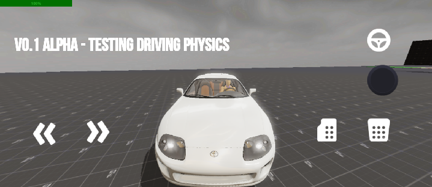
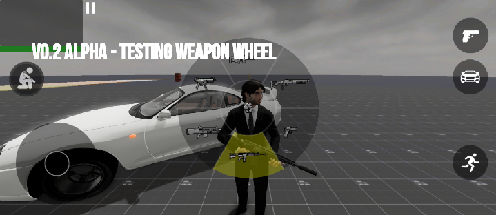

# Path of Criminals

An open-world sandbox prototype for Android focused on driving, AI testing, and LAN multiplayer.

## About

Path of Criminals is a tech demo built to test core gameplay systems before full production. 
This build is for testing and feedback only. Expect bugs, missing features, and changing mechanics.

 

## Download
Get the latest build from the [Releases](../../releases) page.  

**Requirements:** Android 8.0 or higher  
**Installation:** Download the APK and enable “Install from Unknown Sources” in Android settings.

## Features in Testing
- Open-world sandbox environment
- Vehicle driving mechanics  
- Basic AI NPC behavior
- Local LAN multiplayer prototype

## Screenshots

## Reporting Issues
Found a bug or have feedback?  
Open an [Issue](../../issues) and include:
1. Device model and Android version
2. Steps to reproduce
3. Screenshots or logs if available

## Development Status
Active prototype. Scope and features will evolve based on testing.  
Check the Releases page for changelogs and new builds.

## License
This project is released under the MIT License. See [LICENSE](LICENSE) for details.
